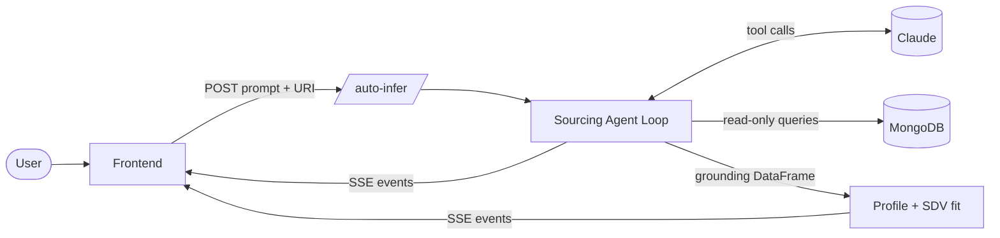
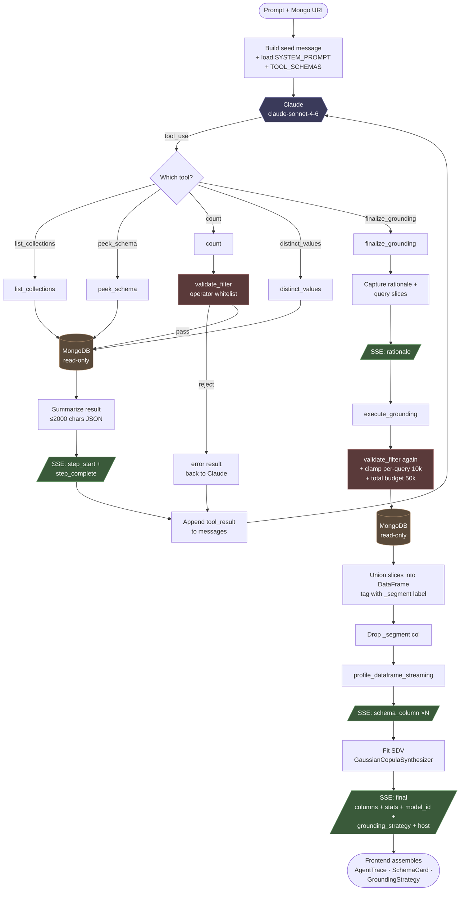
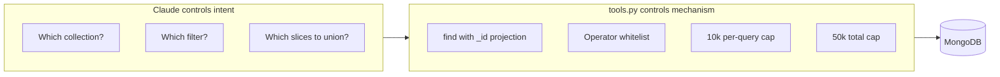

# Sourcing Agent — Simple Flow

## High-level architecture

## What the agent actually does

**Reading it:** the loop in the middle (`Claude → Dispatch → tool → Mongo → Append → Claude`) is the **discovery phase** — Claude keeps probing until it has enough to call `finalize_grounding`. Once it does, control drops out of the loop into the **execution phase** (right side), which re-validates everything and pulls the real grounding rows. The whole flow emits SSE events at every step so the frontend can build the agent trace and schema card live.

## The split: who controls what

**Key idea:** Claude picks *what* to fetch, the tools enforce *how* — so the agent can act on a live cluster without write access, JS execution, or unbounded reads.
