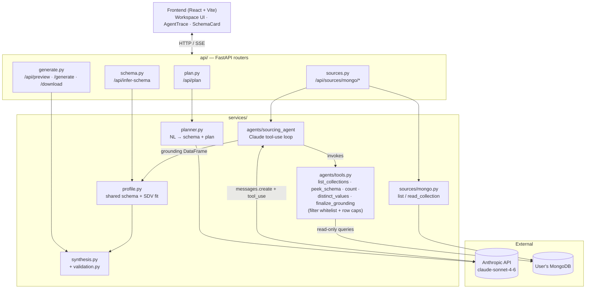

# LLM-Guided Components — Writeup

This document covers the components in the recent commit window that were primarily generated by an LLM under our guidance: the **sourcing agent** (PR #15), the **MongoDB integration** that supports it, the **streaming schema inference** path, and the **backend folder refactor** (PR #13) that made them possible.

## What the code does

### Sourcing agent (`backend/services/agents/sourcing_agent.py`)

A Claude `claude-sonnet-4-6` tool-use loop that, given a user's natural-language prompt and a MongoDB connection, autonomously decides *what slice of their data* should ground synthetic data generation. The agent:

1. Calls read-only tools (`list_collections`, `peek_schema`, `count`, `distinct_values`) to explore the cluster.
2. Identifies the right collection, infers class balance, and finds correlates / edge cases the user described.
3. Calls `finalize_grounding` with a rationale + list of MongoDB query slices (e.g. "all fraud cases" + "stratified legit baseline") that get unioned into a grounding DataFrame.
4. Hands that DataFrame to the existing profile + SDV-fit pipeline (`profile_dataframe_streaming`).

The whole run is streamed back to the UI as SSE events (`step_start`, `step_complete`, `rationale`, `schema_column`, `final`), driving the live agent trace and per-column schema reveal on the frontend.

### MongoDB integration (`backend/services/sources/mongo.py` + `backend/api/sources.py`)

Connection probe, database/collection listing, and DataFrame reads (capped at 50k docs). Endpoints under `/api/sources/mongo/*` expose `test`, `collections`, `infer-schema` (direct read), and `auto-infer` (agent-driven).

### Backend refactor (PR #13)

Split the monolithic API file into `api/`, `core/`, `services/`, `models/` folders so the new agent and source code could land without ballooning a single module.

## Architecture & why this structure

```
api/         ← thin HTTP layer, one router per resource
core/        ← config (LLM client, SDV flags), in-memory state, file IO
services/
  agents/    ← Claude tool-use loop + tool implementations
  sources/   ← external data adapters (currently just Mongo)
  profile.py ← shared column inference + SDV fit (streaming-aware)
  synthesis.py, validation.py, sdv_model.py
```

### Architecture diagram



The shape that matters: **two parallel grounding paths converge on `profile.py`** — a direct file/Mongo read, or an agent-mediated stratified pull — after which the synthesis + validation pipeline is identical regardless of source.

### Sourcing agent discovery flow (sequence)

The agent doesn't connect to Mongo. The loop translates Claude's `tool_use` blocks into pymongo calls and streams progress back to the UI as SSE. Realistic 5-turn run:

```mermaid
sequenceDiagram
    autonumber
    participant UI as Frontend<br/>(AgentTrace · SchemaCard ·<br/>GroundingStrategy)
    participant API as api/sources.py<br/>/auto-infer
    participant Agent as sourcing_agent<br/>run_agent loop
    participant Tools as tools.py<br/>(+ validate_filter)
    participant Claude as Anthropic<br/>claude-sonnet-4-6
    participant Mongo as User's<br/>MongoDB

    UI->>API: POST {uri, db, prompt}
    API->>Agent: run_agent(uri, db, prompt)
    Note over Agent: messages = [user seed:<br/>prompt + db + collection]

    rect rgb(40, 50, 70)
    Note over Agent,Claude: Turn 1 — discover collections
    Agent->>Claude: messages.create(tools=TOOL_SCHEMAS)
    Claude-->>Agent: tool_use: list_collections(db)
    Agent-->>UI: SSE: step_start
    Agent->>Tools: list_collections(uri, db)
    Tools->>Mongo: list_collection_names()<br/>+ estimated_document_count()
    Mongo-->>Tools: [{name, count}, ...]
    Tools-->>Agent: {"collections": [...]}
    Agent-->>UI: SSE: step_complete
    end

    rect rgb(40, 50, 70)
    Note over Agent,Claude: Turn 2 — inspect shape
    Agent->>Claude: messages + tool_result
    Claude-->>Agent: tool_use: peek_schema(claims)
    Agent-->>UI: SSE: step_start
    Agent->>Tools: peek_schema(...)
    Tools->>Mongo: find({}, {_id:0}).limit(5)
    Mongo-->>Tools: 5 docs
    Tools-->>Agent: {"columns": [{name, py_type, sample}]}
    Agent-->>UI: SSE: step_complete
    end

    rect rgb(40, 50, 70)
    Note over Agent,Claude: Turn 3-4 — measure class balance
    Agent->>Claude: messages + tool_result
    Claude-->>Agent: tool_use: count({FraudFound_P: 1})
    Agent->>Tools: count_with_filter(...)
    Tools->>Tools: validate_filter ✓
    Tools->>Mongo: count_documents({...})
    Mongo-->>Tools: 923
    Tools-->>Agent: {"count": 923}
    Agent-->>UI: SSE: step_start / step_complete
    Agent->>Claude: messages + tool_result
    Claude-->>Agent: tool_use: distinct_values(Fault)
    Agent->>Tools: distinct_values(...)
    Tools->>Mongo: aggregate($group, $sort, $limit)
    Mongo-->>Tools: [{value, count}, ...]
    Tools-->>Agent: {"values": [...]}
    Agent-->>UI: SSE: step_start / step_complete
    end

    rect rgb(50, 70, 50)
    Note over Agent,Claude: Turn 5 — decide
    Agent->>Claude: messages + tool_result
    Claude-->>Agent: tool_use: finalize_grounding<br/>{rationale, queries:[fraud, legit]}
    Agent-->>UI: SSE: step_start
    Agent-->>UI: SSE: rationale<br/>(strategy preview)
    Agent-->>UI: SSE: step_complete
    Note over Agent: break loop
    end

    rect rgb(70, 50, 50)
    Note over Agent,Mongo: Post-loop — actually pull the data
    Agent->>Tools: execute_grounding(queries)
    loop per slice
        Tools->>Tools: validate_filter ✓ (again)
        Tools->>Tools: clamp limit (≤10k, ≤remaining budget)
        Tools->>Mongo: find(filt, {_id:0}).limit(N)
        Mongo-->>Tools: docs
    end
    Tools-->>Agent: (DataFrame, query_stats)
    Agent->>Agent: drop _segment column
    end

    rect rgb(50, 60, 70)
    Note over Agent,UI: Profile streaming (shared with file path)
    Agent->>Agent: profile_dataframe_streaming(df)
    Agent-->>UI: SSE: schema_start
    loop per column
        Agent-->>UI: SSE: schema_column
    end
    Agent-->>UI: SSE: fitting_model
    Note over Agent: SDV GaussianCopula fit
    Agent-->>UI: SSE: final<br/>{columns, stats, model_id,<br/>grounding_strategy, host}
    end

    API-->>UI: stream ends
```



**Reading the diagram:**

- **Blue blocks (turns 1–4)** — the *discovery* phase. Claude has no schema info at turn 1 and incrementally builds a mental model by calling read-only tools. Each turn produces two SSE events (`step_start`, `step_complete`) that drive a new row in the agent trace panel.
- **Green block (turn 5)** — the *decision* phase. Claude calls `finalize_grounding` with a rationale and a list of query slices. This produces a `rationale` SSE event that immediately renders the strategy preview in the UI, *before* the data is actually pulled.
- **Red block** — *execution*. `execute_grounding` runs the proposed queries against Mongo, re-validating every filter and enforcing the 10k/50k caps. This is the only place real data crosses the network.
- **Final blue block** — *profiling*. Same generator that the file-upload path uses; produces one `schema_column` event per column (paced to 50ms minimum so the UI reveal is visible), then `fitting_model` while SDV fits, then the terminal `final` event carrying everything the frontend needs.

The asymmetry to notice: **Claude controls intent (which collection, which filter), `tools.py` controls mechanism (`find` with projection, capped limits, whitelisted operators)**. Claude never sees raw documents, never opens a socket, never picks a query method. It picks slices; the tools picks how to pull them.

### Key design choices

- **Tool-use loop instead of a single mega-prompt.** The agent has to *interactively* probe a cluster whose schema it can't see ahead of time. A single prompt couldn't enumerate collections or count rows — only tools can. The 5-tool whitelist (`list_collections`, `peek_schema`, `count`, `distinct_values`, `finalize_grounding`) is intentionally small so Claude reliably picks the right one.
- **Filter operator whitelist** (`$eq`, `$gt`, `$in`, `$exists`, …) + per-query and total row caps (10k / 50k) in `tools.py`. The agent is given a user's live DB URI, so the surface area has to be *read-only by construction*, not by trust.
- **SSE streaming, not request/response.** A multi-turn Claude loop takes 10–30s; blocking the HTTP call would leave the UI silent. Streaming events from `run_agent` directly into a FastAPI `StreamingResponse` lets the frontend show each tool call as it happens.
- **Shared `profile_dataframe_streaming`** so the agent path and the file-upload path produce identical schema/stats/SDV-model outputs — the rest of the pipeline (generate, preview, validation) doesn't need to know where the grounding came from.
- **Folder split (PR #13)** keeps HTTP concerns (`api/`), domain logic (`services/`), and infra (`core/`) independent, so adding a new source (Postgres, S3) is a matter of dropping a module into `services/sources/` without touching the API layer.

### Dependencies

- **FastAPI** — HTTP + SSE
- **pymongo** — read-only Mongo client
- **pandas** — uniform DataFrame interface across sources
- **SDV** — `GaussianCopulaSynthesizer` for correlation-preserving synthesis
- **Anthropic SDK** — `claude-sonnet-4-6` for both the planner and the sourcing agent

## Deep dive: MongoDB integration

The Mongo integration is a thin, read-only adapter wrapped by a router. It exists so that "uploaded files" and "live cluster" can drop into the same downstream pipeline without the rest of the backend caring which source produced the rows.

### `services/sources/mongo.py` — the adapter

A single module that owns *all* direct contact with `pymongo`. Three public functions plus one helper:

| Function | Purpose |
|---|---|
| `safe_host(uri)` | Strip credentials from a Mongo URI for display (e.g. `cluster0.abc.mongodb.net`). Used so the frontend never echoes back the password the user typed in. |
| `list_databases(uri)` | Ping the cluster (`admin.command("ping")`), then return non-system databases. Returns `{ok, host, databases}` or `{ok: False, error}` — failure is part of the contract, not an exception. |
| `list_collections(uri, db)` | Per collection, returns name + `estimated_document_count()`. Per-collection errors are swallowed (count becomes `None`) so one bad collection doesn't fail the whole listing. |
| `read_collection(uri, db, collection, limit=50_000)` | Pull up to `limit` documents into a pandas DataFrame, dropping `_id` server-side via projection. |

Module-level constants:

- `DEFAULT_READ_LIMIT = 50_000` — hard cap on a single read so a user can't accidentally pull a billion-row collection.
- `CONNECT_TIMEOUT_MS = 5_000` — short timeout so a wrong URI fails fast instead of hanging the request.
- `SYSTEM_DBS = {"admin", "local", "config"}` — filtered out of `list_databases`.

### `api/sources.py` — the HTTP surface

A FastAPI router mounted at `/api/sources/mongo`. Four endpoints, all `POST` (they take a URI in the body, never the query string, so creds don't end up in logs):

| Endpoint | Body | What it does |
|---|---|---|
| `POST /test` | `{uri}` | Probes the cluster. Drives the "Test connection" button in the integrations modal. |
| `POST /collections` | `{uri, db}` | Lists collections for a chosen database. Populates the collection dropdown. |
| `POST /infer-schema` | `{uri, db, collection}` | Reads one collection into a DataFrame and runs the shared `profile_dataframe()` pipeline. Returns the same payload shape as file upload. |
| `POST /auto-infer` | `{uri, db, collection?, prompt}` | Hands off to the sourcing agent (covered below) and streams its progress back as SSE. |

The first three endpoints are intentionally dumb — they exist to let the user click through the integrations modal step-by-step (test → pick DB → pick collection → infer). The fourth is where the LLM takes over.

### The "source-agnostic" seam: `services/profile.py`

The reason the integration is small is that **profiling is shared**. Both the file-upload path (`api/schema.py`) and the Mongo path (`api/sources.py`) call `profile_dataframe(df)`, which produces a uniform payload:

```json
{
  "columns": [{ "column": "age", "type": "int", "distribution": "Gaussian (μ=52, σ=8)", "sample": "54", "null_pct": 0.0 }],
  "stats":   { "age": { "col_type": "int", "mean": 52.1, "std": 8.3, ... } },
  "source_rows": 50000,
  "model_id": "c3f1a2b4-..."
}
```

Everything downstream — `/api/preview`, `/api/generate`, validation — only knows about this payload. It has no idea whether the rows came from a CSV or a Mongo cursor. That's the design contract that makes adding new sources cheap.

## Deep dive: Data sourcing (the agent)

"Data sourcing" here means: given a live MongoDB cluster and a free-text prompt, decide *what subset of the data* should be used to ground synthesis. This is delegated to a Claude tool-use agent rather than handcoded heuristics, because the right slice depends on the user's intent ("fraud detection cohort" vs "general customer behaviour" vs "rare drug interactions").

### Why an agent at all

A single LLM call can't do this. The model has never seen the user's schema, doesn't know what collections exist, doesn't know the class balance. Either we (a) dump the whole DB into the prompt — expensive and leaky, or (b) give the model **tools** to probe the DB itself and let it form a strategy from what it finds. We chose (b).

### The toolset (`services/agents/tools.py`)

Five tools, four for inspection and one to terminate the loop:

| Tool | Input | Output | Purpose |
|---|---|---|---|
| `list_collections` | `{db}` | `[{name, count}]` | Discover what collections exist when the user didn't pick one. |
| `peek_schema` | `{db, collection, n_samples=5}` | columns + Python types + sample values | Understand a collection's shape without dumping documents. |
| `count` | `{db, collection, filter}` | `{count: int}` | Measure class balance / how many rows match a condition. |
| `distinct_values` | `{db, collection, field, limit=20}` | top-N values with frequencies | See categorical distributions; useful for finding correlates. |
| `finalize_grounding` | `{rationale, queries: [...]}` | (terminates loop) | Declare the final sampling strategy. |

**Safety layer — `validate_filter()`:** every filter that comes from the model is recursively walked against an operator whitelist:

```
$eq, $ne, $gt, $gte, $lt, $lte, $in, $nin, $exists
```

Anything outside that set (`$where`, `$function`, `$expr`, …) is rejected before it ever hits pymongo. Coupled with using projection-based `_id` exclusion and `.find(...).limit(...)`, the model has *no path* to write, delete, run JavaScript, or pull unbounded data — even if it tried.

**Quantitative caps:**
- `MAX_PER_QUERY_LIMIT = 10_000` — per-slice cap.
- `MAX_TOTAL_GROUNDING_ROWS = 50_000` — total across all slices.

`execute_grounding()` enforces both, decrementing a `remaining` budget as it walks the agent's `queries` list and breaking early when the budget hits zero.

### The agent loop (`services/agents/sourcing_agent.py`)

```
┌──────────────────────────────────────────────────────────────┐
│ messages = [{role: user, content: prompt + db + collection}] │
└──────────────────────────────────────────────────────────────┘
                              │
                              ▼
┌──────────────────────────────────────────────────────────────┐
│  for turn in 1..MAX_TURNS:                                   │
│    response = claude.messages.create(                        │
│      model="claude-sonnet-4-6",                              │
│      system=SYSTEM_PROMPT,                                   │
│      tools=TOOL_SCHEMAS,                                     │
│      messages=messages)                                      │
│                                                              │
│    for tool_use in response.content:                         │
│      if name == "finalize_grounding":                        │
│         break the loop, run execute_grounding(queries)       │
│      else:                                                   │
│         result = _execute_tool(name, input, uri)             │
│         yield {step_start} … {step_complete}                 │
│         append tool_result to messages                       │
└──────────────────────────────────────────────────────────────┘
                              │
                              ▼
┌──────────────────────────────────────────────────────────────┐
│ df = execute_grounding(queries)        # union all slices    │
│ for event in profile_dataframe_streaming(df):                │
│     yield event                        # SSE per column      │
│ yield {final, columns, stats, model_id, grounding_strategy}  │
└──────────────────────────────────────────────────────────────┘
```

Loop budget: `MAX_TURNS = 12`, `MAX_TOKENS_PER_TURN = 1024`. The system prompt explicitly tells the model "3–6 tool calls before finalizing is normal" so it doesn't waste turns being exhaustive.

### System prompt — what the agent is told to do

Paraphrased from the actual `SYSTEM_PROMPT`:

1. Discover which collection contains the relevant data (if not pre-specified).
2. Understand the schema and base rates of important columns.
3. Identify class imbalance, correlates, and edge cases that match the user's prompt.
4. Decide a sampling strategy — *usually a stratified mix that amplifies rare classes* so the synthesis output is learnable.
5. End by calling `finalize_grounding` with a non-technical rationale + the query specs.

The "amplify rare classes" instruction is the key insight: most interesting synthetic-data use cases (fraud, churn, rare disease) are class-imbalanced. A naive random sample wastes capacity on the majority class. The agent is told to bias the grounding mix on purpose.

### What "finalizing" actually produces

The agent's `finalize_grounding` call carries:

```json
{
  "rationale": "Fraud is ~6% of records. I'm pulling all fraud cases and an equal-size legitimate sample to give the synthesizer a balanced view.",
  "queries": [
    {"db": "insurance", "collection": "claims", "filter": {"FraudFound_P": 1}, "limit": 2000, "label": "fraud cases"},
    {"db": "insurance", "collection": "claims", "filter": {"FraudFound_P": 0}, "limit": 2000, "label": "legit baseline"}
  ]
}
```

`execute_grounding()` then:
1. Re-validates every filter (defence in depth — the agent's claim isn't trusted).
2. Runs each query with `find(filt, {"_id": 0}).limit(limit)`.
3. Tags each row with a `_segment` label so we know which slice it came from.
4. `pd.concat`s the slices into one DataFrame.
5. Drops `_segment` before profiling (it's a synthetic column, shouldn't leak into the schema).

That DataFrame is then handed to the same `profile_dataframe_streaming()` used by file uploads.

### The event stream — what the frontend sees

The agent yields a sequence of dicts that the router (`/api/sources/mongo/auto-infer`) JSON-encodes as SSE frames:

| Event | When | UI uses it for |
|---|---|---|
| `step_start` | Before each tool call | Add a row to the agent trace panel |
| `step_complete` | After each tool call | Mark the row done + show summary |
| `rationale` | When `finalize_grounding` fires | Show the human-readable strategy + slice list |
| `schema_start` / `schema_column` / `fitting_model` / `schema_complete` | During profiling | Build the schema card row-by-row |
| `final` | At the very end | Hand back `columns`, `stats`, `model_id`, `grounding_strategy`, `host` |
| `error` | On failure | Surface the message in the UI |

The same stream drives **two** distinct UI panels (agent trace + schema card) — that's the payoff for collapsing schema profiling into a generator: the agent run produces both visualisations from one continuous event sequence.

## Alternatives considered

1. **One big "do everything" prompt instead of tool-use.** Rejected — the model can't see collections it hasn't been told about, and we'd have to dump entire schemas into the context. Tool-use lets the agent pull only what it needs and gives us a natural audit trail.
2. **Letting the agent write raw MongoDB queries.** Rejected for safety — instead, queries flow through `validate_filter`, the operator whitelist, and row caps. The agent picks *what* to fetch; the backend controls *how*.
3. **Synchronous request/response with a final JSON payload.** Rejected — multi-turn agent runs are slow enough that the UX needs visible progress (the agent trace panel). SSE was the simplest path that didn't require websockets.
4. **Pulling the entire collection and letting SDV figure it out.** Rejected because the interesting use case is *imbalanced* data (e.g. fraud detection with <1% positives). Random reads would drown the signal — the agent's job is to propose stratified sampling that amplifies rare classes the user cares about.
5. **Keeping the backend as one file.** Worked for the file-upload-only MVP but became untenable once Mongo, the agent, and streaming all needed to coexist — hence the PR #13 refactor before PR #15 landed.
